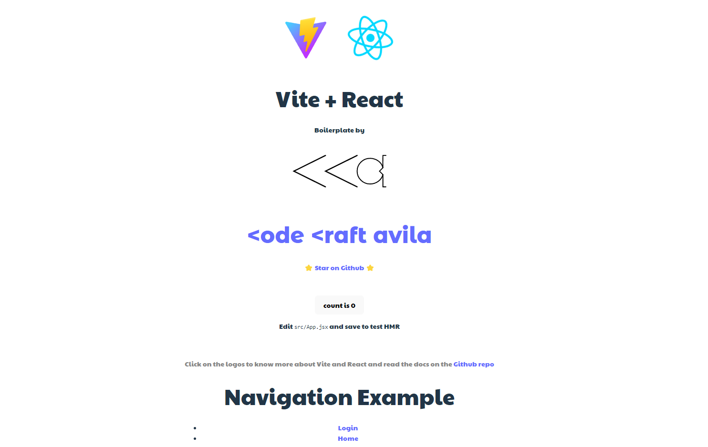
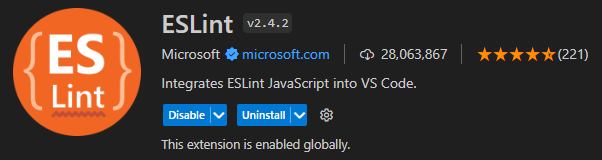
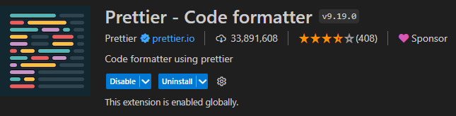
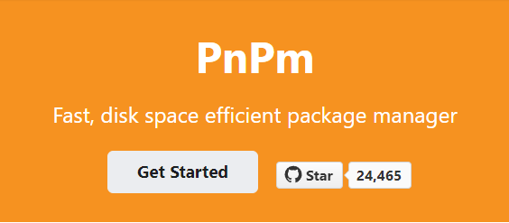
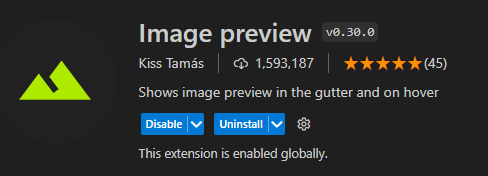
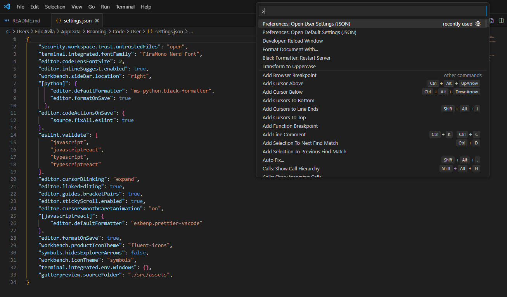
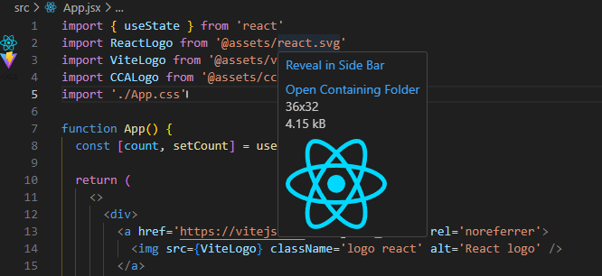
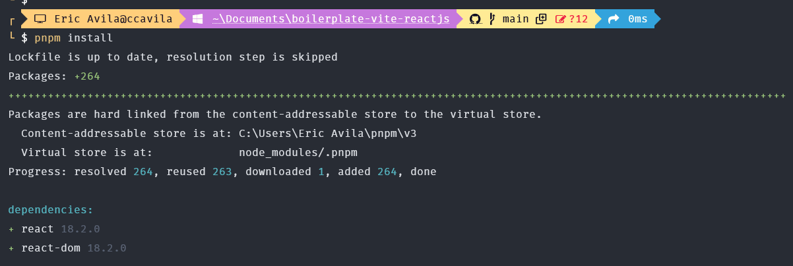
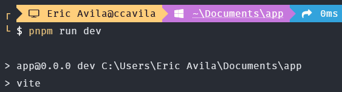
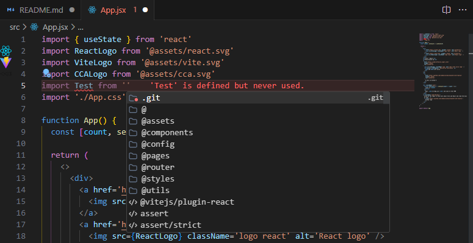

# boilerplate-vite-reactjs

## Description

This project is created for ReactJS using the PNPM Package Manager. It comes with basic ESLint and Prettier configurations, as well as the use of relative paths based on the project's path structure. Essentially, it's a boilerplate that helps you kickstart your projects quickly and easily.



## Table of content

- [boilerplate-vite-reactjs](#boilerplate-vite-reactjs)
  - [Description](#description)
  - [Table of content](#table-of-content)
  - [Requeriments](#requeriments)
    - [Eslint Plugin](#eslint-plugin)
    - [Prettier Plugin](#prettier-plugin)
    - [PNPM Package Manager](#pnpm-package-manager)
    - [Image Preview (optional)](#image-preview-optional)
      - [Fix](#fix)
  - [Usage](#usage)
  - [Configuration description](#configuration-description)
    - [Alias path config](#alias-path-config)
      - [vite.config.js](#viteconfigjs)
      - [jsconfig.json](#jsconfigjson)
    - [.prettierrc](#prettierrc)
    - [React Router v6](#react-router-v6)
- [Thanks](#thanks)

---

## Requeriments 

- ### **ESLINT Plugin**
[Direct Link](https://marketplace.visualstudio.com/items?itemName=dbaeumer.vscode-eslint)



- ### **PRETTIER Plugin**
[Direct Link](https://marketplace.visualstudio.com/items?itemName=esbenp.prettier-vscode)



- ### **PNPM Package manager**
[Install Docs](https://pnpm.io/es/installation)



- ### **Image Preview** (Optional)
[Direct Link](https://marketplace.visualstudio.com/items?itemName=kisstkondoros.vscode-gutter-preview)


This plugin is a lifesaver! It gives you a sweet preview of your image files, no matter the extension (svg, png, jpg, you name it). You'll find it on the left side, right next to the line number. Just hover your cursor over the path, and voila! You'll see the image pop up, even within the component.

#### Fix

If the plugin doesn't display the images, simply add the following property in the VSCODE JSON file called "Open User Settings (JSON)". Just make sure to add the appropriate path for your project.

```js
"gutterpreview.sourceFolder": "./src/assets"
```




**Example**



---

## Usage
Console commands

```shell
pnpm install
```

```shell
pnpm run dev
```






---
## Configuration description

### Alias path config

#### vite.config.js

Check out the vite.config.js file! That's where you'll find all the routes with their fancy aliases for the project. If you want to add a new route, simply follow the same writing style as shown in the line below.

```js
import { fileURLToPath, URL } from "url";
import { defineConfig } from "vite";
import vue from "@vitejs/plugin-react";

// https://vitejs.dev/config/
export default defineConfig({
  plugins: [vue()],
  resolve: {
    alias: [
      { find: '@', replacement: fileURLToPath(new URL('./src', import.meta.url)) },
      { find: '@assets', replacement: fileURLToPath(new URL('./src/assets', import.meta.url)) },
      { find: '@components', replacement: fileURLToPath(new URL('./src/components', import.meta.url)) },
      { find: '@config', replacement: fileURLToPath(new URL('./src/config', import.meta.url)) },
      { find: '@pages', replacement: fileURLToPath(new URL('./src/pages', import.meta.url)) },
      { find: '@router', replacement: fileURLToPath(new URL('./src/router', import.meta.url)) },
      { find: '@styles', replacement: fileURLToPath(new URL('./src/styles', import.meta.url)) },
      { find: '@utils', replacement: fileURLToPath(new URL('./src/utils', import.meta.url)) },
    ],
  },
});
```

#### jsconfig.json

```js
{
    "compilerOptions": {
       "baseUrl": ".",
       "paths": {
         "@/*": ["/src/*"],
         "@assets/*": ["/src/assets/*"],
         "@components/*": ["/src/components/*"],
         "@config/*": ["/src/config/*"],
         "@pages/*": ["/src/pages/*"],
         "@router/*": ["/src/router/*"],
         "@styles/*": ["/src/styles/*"],
         "@utils/*": ["/src/utils/*"],
       }
    }
 }
```

> ⚡VSCODE will automatically detect the routes and suggest them in autocomplete.



---
### .prettierrc

PRETTIER is the handy tool you need to keep your code in check! It's like having a code format enforcer that ensures everything looks clean and organized. When you collaborate with others on the same project, thanks to PRETTIER's rules, there won't be a jumbled mess of code styles.

Need some extra rules? Check out this link: [Rules Prettier]([/guides/content/editing-an-existing-page](https://prettier.io/docs/en/options.html)). Although the configurations already in the file should cover your needs, it's always good to have more choices based on personal preference and team organization. But honestly, what you have here is more than sufficient to get things rolling.


```js
{
    "userTabs": true,
    "semi": false,
    "singleQuote": true,
    "jsxSingleQuote": true,
    "bracketLine": true,
    "arrowParens": "avoid",
    "endOfLine": "lf"
}
```

---

### React Router v6

Good news! We've integrated React Router into the project. To manage your project's routes, simply navigate to the ***"src\router\routes.jsx"*** file. There, you can easily configure the URL routes and associate them with the respective components. This way, you'll have full control over the navigation in your project.

```js
import App from '@/App'
import Login from '@pages/Login/Login'
import Home from '@pages/Home/Home'

const routes = [
  { path: '/', element: <App /> },
  { path: '/login', element: <Login /> },
  { path: '/home', element: <Home /> },
]

export default routes
```
---
---
# Thanks
> If this repository has been helpful to you, please show your support by giving it a star. It would mean the world to me, and I'll be extremely grateful. Thank you!


Make sure to swing by my Personal Blog! You never know what gems you'll discover that could be of value to you or your buddies.

⭐⭐⭐ [<ode <raft avila Blog](https://codecraftavila.super.site/) ⭐⭐⭐
